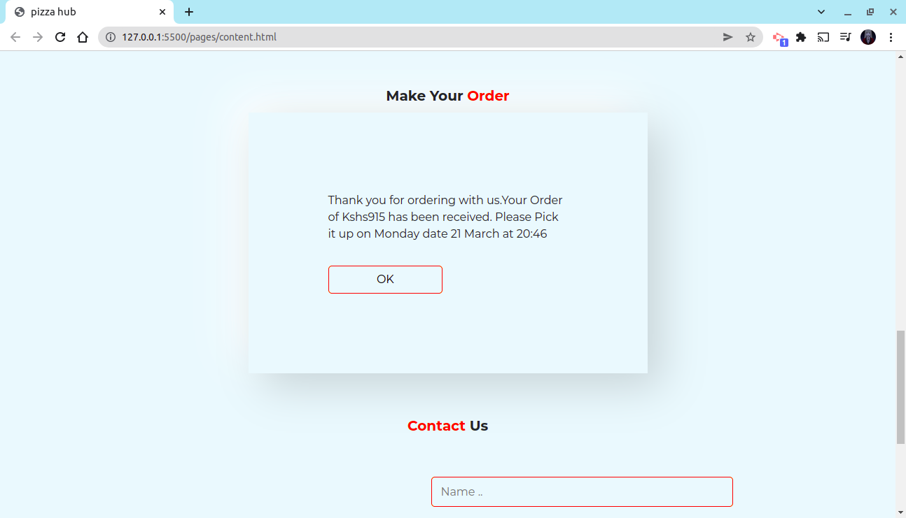

# pizzahub

<h1>Pizza hub</h1>

<h4>This a website for a fictional pizza restaurant</h4>

 

 

<h2>Landing Page</h2>

 

 
<h2>Carousel Section</h2>

 

 
<h2>Qualities Section</h2>

 

 
<h2>Menu Section</h2>

 

 
<h2>Order form</h2>

 

 
<h2>Orders table</h2>

 

 
<h2>Delivery Location Form</h2>

 

 
<h2>Confirmation text</h2>

 

## Table of Content

- [Description](#description)
- [Installation Requirement](#Installation)
- [Technology Used](#technology-used)
- [Reference](#reference)
- [Licence](#licence)
- [Authors Info](#author-Info)
- [ToDO](#To-Do)

## Description

 Pizza hub is a website for a fictional pizza restaurant where users can order pizza and Choose whether they want it to be delivered to the or not

## Installation

### Requirements

- Devices such as tablet , phones , laptops and desktop computers.

- Access to the internet.

### Installation Process

---

Click on the link below to view the live site
<a href="https://charity-bit.github.io/Delani_Studio/">https://charity-bit.github.io/Delani_Studio/<a>

---

git clone - to clone this repo

## Technology Used

- HTML - which was used to build the structure of the pages.

- CSS - which was used to style the pages.

- JAVASCRIPT - which was used to toggle between classes for navigation.

- BOOSTRAP - used incombination with css for styling.
- JQUERY - used in combination with vanilla js for DOM manipulation

## Reference

- <a href="https://developer.mozilla.org/en-US/"> MDN Web Docs</a>

## Licence
MIT License

Copyright (c) 2022 Nyanchera

Permission is hereby granted, free of charge, to any person obtaining a copy
of this software and associated documentation files (the "Software"), to deal
in the Software without restriction, including without limitation the rights
to use, copy, modify, merge, publish, distribute, sublicense, and/or sell
copies of the Software, and to permit persons to whom the Software is
furnished to do so, subject to the following conditions:

The above copyright notice and this permission notice shall be included in all
copies or substantial portions of the Software.

THE SOFTWARE IS PROVIDED "AS IS", WITHOUT WARRANTY OF ANY KIND, EXPRESS OR
IMPLIED, INCLUDING BUT NOT LIMITED TO THE WARRANTIES OF MERCHANTABILITY,
FITNESS FOR A PARTICULAR PURPOSE AND NONINFRINGEMENT. IN NO EVENT SHALL THE
AUTHORS OR COPYRIGHT HOLDERS BE LIABLE FOR ANY CLAIM, DAMAGES OR OTHER
LIABILITY, WHETHER IN AN ACTION OF CONTRACT, TORT OR OTHERWISE, ARISING FROM,
OUT OF OR IN CONNECTION WITH THE SOFTWARE OR THE USE OR OTHER DEALINGS IN THE
SOFTWARE.

 ## TO Do
  <ul>
    <li>Odering details validation </li>
      </ul>
 

 [Go Back to the top](#pizzahub)

## Authors Info

LinkedIn - [Charity Nyanchera](https://www.linkedin.com/in/charity-nyanchera-2679281a2/)

twitter - [Twitter](https://twitter.com/CcNyanchera)

[Go Back to the top](#pizzahub)
  
 

